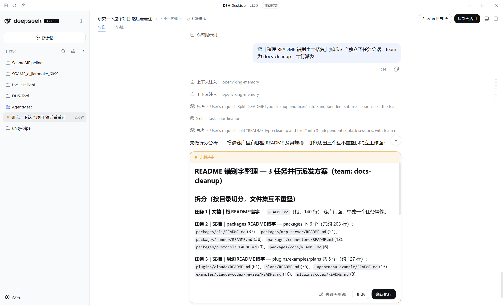
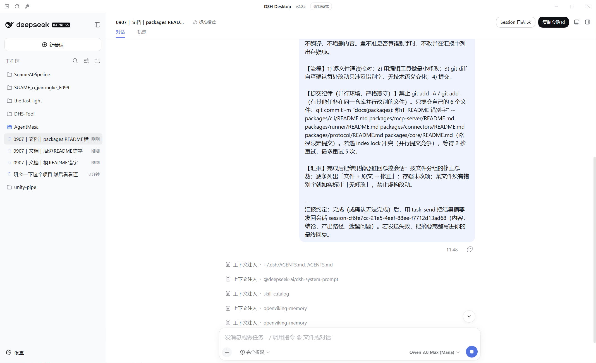
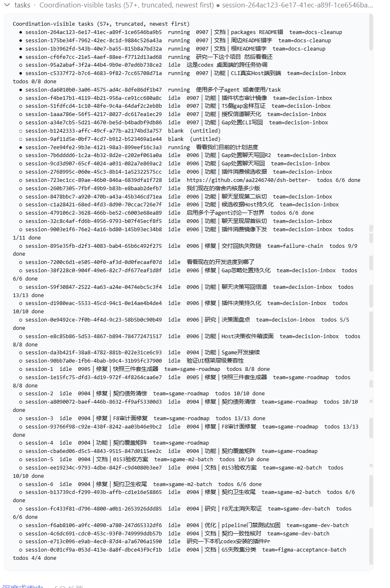
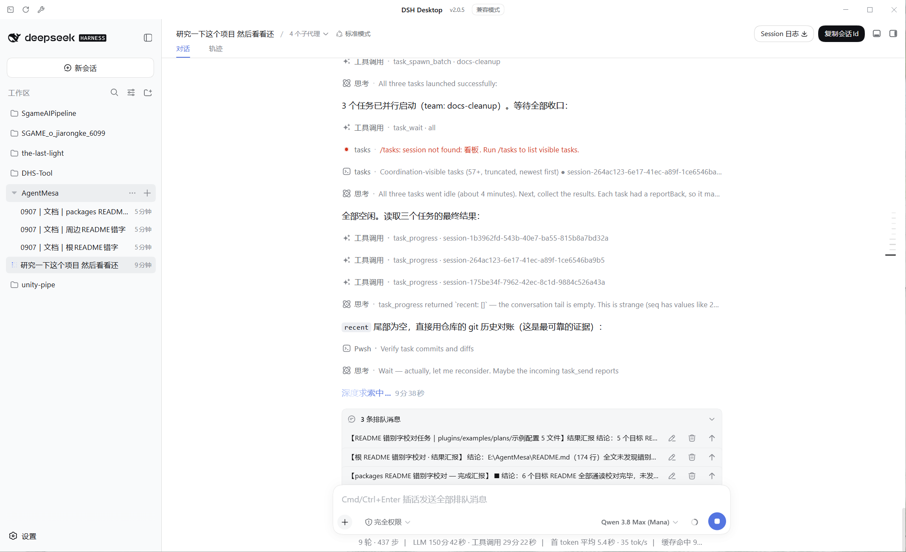

<div align="center">

<picture>
  <source media="(prefers-color-scheme: dark)" srcset="./assets/banner-dark.svg">
  
</picture>

**Codex-style cross-task coordination · a supervisor plugin for DeepSeek Harness**

[](docs/PROTOCOL.md)
[](package.json)
[](test/smoke.test.mjs)
[](LICENSE)

[What is this](#what-is-this) · [Screenshots](#screenshots) · [Quick start](#quick-start) · [Tools](#the-eleven-tools) · [Architecture](docs/ARCHITECTURE.md) · [Host contract](docs/PROTOCOL.md) · [Changelog](CHANGELOG.md) · [Chinese](README.zh-CN.md)

</div>

---

## What is this

**Once installed, you just say what should run in parallel — the `task_*` tools handle every step of the orchestration:**

```text
Split this into three tasks and run them in parallel: A researches the approach,
B builds the prototype, C runs the tests. Summarize for me when they finish.
```

What happens behind the scenes: you (plain language) → supervisor session → decomposition analysis → **an approval card you confirm** → batch-spawned task sessions → each task reports its result back when done → the supervisor summarizes. You never watch a single step in between, but the decision points stay in your hands.

- This is a DSH plugin: **any top-level session** can discover tasks, read progress, spawn tasks and deliver instructions;
- Spawned tasks **appear in the GUI session list immediately** (the same `api-session/added` event the sidebar consumes);
- Every cross-task message is stamped with a `coordinator` source — visible and attributable in the target session's transcript;
- One prerequisite: **DSH Desktop is installed and starts** (the plugin never launches the host for you).

> 📌 Host contract verified on **DSH 0.1.2-alpha.1**; every capability passed real-host end-to-end testing after restart (criteria in [Host contract](docs/PROTOCOL.md)).

## Screenshots

<table>
  <tr>
    <td></td>
    <td></td>
  </tr>
  <tr>
    <td></td>
    <td></td>
  </tr>
</table>

<sub><i>Live GUI captures — the same four shots are declared in <code>screenshots.json</code> for the dsh-market detail view.</i></sub>

## Quick start

### Prerequisites

- DSH Desktop (contract verified on 0.1.2-alpha.1);
- Node.js `^22.19.0 || >=24` (the host runtime usually satisfies this already);
- PowerShell (the deploy script is `.ps1`).

### Install (one command)

> 🛒 **Listed on [awesome-dsh-plugin](https://github.com/awesome-dsh-plugin/awesome-dsh-plugin) (Workflow & Automation)** — with the in-app [dsh-market](https://github.com/dsh-market/dsh-market) plugin browser, search “task-coordinator” and install/upgrade with one click. The git-clone route below is the no-market equivalent.

```powershell
git clone https://github.com/Kayungko/dsh-plugin-task-coordinator.git
cd dsh-plugin-task-coordinator
pwsh install.ps1 -Source .
```

The script does three things: copies the plugin into the profile's `node_modules/` (no `pnpm install`, the lockfile stays untouched), registers the dependency + bundle in the profile manifest, and updates `.package-map.json` — **everything is backed up first** into `backups/<timestamp>/`.

**Restart DSH Desktop** afterwards — any session can then use the eleven tools and the `/tasks` command.

> 💡 `install.ps1` defaults `-Source` to `$PSScriptRoot/plugin` (workspace layout); when running from the plugin repo itself, **pass `-Source .` explicitly**.
> Re-running is safe: file copies are idempotent and manifest registration de-duplicates.

### Verify

After the restart, send this to any session:

`List the currently visible tasks`

It calls `task_list` and returns the task list (an empty list is a valid answer) — the tools are mounted ✅

Uninstall: `pwsh install.ps1 -Source . -Uninstall` (also takes effect after restart).

## Directing the supervisor (prompting that actually works)

The model only coordinates when it can map your words to the tools. Vague prompts like "you may use the /task plugin whenever you want" are discretionary — sessions tend to default to working solo (field-verified failure mode). Two rules:

1. **Name the tools, use imperative mood.** Example: "Split the remaining work with `task_spawn_batch` into parallel sub-task sessions (give them a team name); collect results with `task_wait`. Don't do everything in this session."
2. **In /goal mode the coordination mandate must live inside the goal objective** — every continuation round re-anchors on that text alone. Recommended objective:

> As the supervisor session, take over the remaining development: ① splittable work MUST be dispatched to parallel sub-task sessions via task_spawn_batch (attach a team name) — do not do everything yourself; ② collect results with task_wait and integrate them; ③ sub-task sessions may further parallelize with their own subagents; ④ push to remote main at every milestone.

Loose wordings ("/task plugin", "coordinate things") are recognized too — the bundled skill carries an alias table and the tool descriptions carry trigger context since 0.9.0 — but the imperative template above is the reliable form, especially for goal objectives.

## The eleven tools

| Tool | Purpose |
|---|---|
| `task_list` | List coordination-visible tasks with stable session ids, status, titles, todo/goal progress; filterable by `team`; `ungrouped: true` (0.19.0) lists only sessions belonging to NO workspace — the remediation view for the ungrouped bucket, paired with `task_workspace` and the registry's `expectedWorkspace` |
| `task_progress` | Read one task in depth: live/cold state, queued messages, conversation tail, todos, goal |
| `task_send` | Deliver a visible follow-up prompt (`mode: queue` or `steer`; `reference` links an earlier instruction); returns a `messageId` plus a `queueDepth` receipt `{nextTurn, nextStep}` (post-send; one next-turn message is consumed per round, so depth N ≈ N rounds before it is read) |
| `task_spawn` | Create + name + kick off a brand-new task (title follows the `MMDD｜type｜topic` rule; groupable via `team`); returns a `correlationId`; appends the report-back convention by default; **workspace placement fallback chain** (0.19.0): exact-match attachment (0.12.0) → subdirectory attaches to the NEAREST ancestor workspace with the session cwd normalized to the workspace root (default `ancestor` policy, stated in both the receipt and the kickoff) → git worktrees deliberately stay ungrouped to preserve isolation (strong warning) → every ungrouped landing carries a warning + remediation hint; receipts always report `workspace` ({id,title} | null) and the `placement` enum; optional `provider`+`model` (+`reasoningEffort`) select the child's LLM route, installed before the kickoff (0.13.0); omitted, the spawn falls back to the plugin's configured default route (Settings → 任务编排, 0.18.0), then the host default |
| `task_confirm` | Present a decomposition/dispatch plan as an **interactive approval card** and block until the user answers; approval mints a single-use `confirmationId` |
| `task_confirm_select` | Present the proposed task list as a **multi-select card** (host's neutral question UI — no amber styling): the user checks which tasks to dispatch (partial dispatch) with an optional custom-feedback row; approval binds the `confirmationId` to the selected subset and `task_spawn_batch` enforces it (`confirmation-mismatch` otherwise) |
| `task_spawn_batch` | Spawn a whole decomposition plan in one call (`tasks: [{title?, prompt}]` + one `team`); requires the `confirmationId` once the batch reaches the confirmation threshold; one failed item does not abort the rest |
| `task_wait` | Block until one task becomes idle (or timeout); multi-target (`sessionIds` + `mode: all/any`); cold targets (no live agent) report idle immediately — cold ≠ no pending work |
| `task_cancel` | Cancel the target's active turn, keeping its queued messages (the stopped target needs a new message to wake — cancellation does not auto-drain the queue) |
| `task_workspace` | List host workspaces, `attach` / `detach` an **existing** session (fix the ungrouped bucket), or `migrate` it to a **different** workspace (0.16.0): clones the full history into a new session born with the target cwd, attaches the clone, workspace-archives the original and returns the new id (workspace-level fold: the old session stays readable and resumable — messaging it would fork the work); refuses running sessions (`task_wait` first). Goes through the live workspace entity and never touches a session's conversation |
| `task_models` | List the **exact model routes this deployment serves** — provider/model/reasoning-effort ids from the host's live catalog (the GUI picker's source) plus the app-wide default and the plugin's configured `pluginDefault` (0.18.0); consult before spawning with `provider`+`model`, never guess ids (0.14.0) |

### `/tasks` — the no-model fast lane

Read-only lookups can bypass the model entirely: `/tasks` (all tasks), `/tasks team <name>` (one workstream), `/tasks <sessionId>` (one task's progress, short-id prefixes resolve when unique). The command executes directly in the host — zero tokens, instant answer. Anything that *acts* (send/spawn/wait/cancel) still goes through the tools.

### Copying session ids — one click in the session header

The plugin ships a small **web client module** (`client.js`, declared via `dsh.client` in `package.json`) that occupies two official slots. ① `conversation.session.header.utilities` — the same seam the shipped `session-log-export` package uses: every session header gets a **Copy Session ID** button (filled pill matching the Session-log button geometry: black-on-white in light mode, white-on-black in dark mode) that copies the session's full `sessionId` to the clipboard, ready to paste into `task_send`, `task_progress` or `/tasks <id>` on the supervisor side. (The sidebar's per-session context menu is hard-coded in the host and cannot be extended — field-verified — so the header slot is the sanctioned place.) ② `settings.section` (0.18.1): a first-level **Task Orchestration** page in the settings left nav (beside General/Models/Plugins/Agent presets, order 25) that edits the default spawn model (see the section above).

### Workspace placement: the five-tier fallback chain, fully observable (0.19.0)

Spawned children attach to the caller's workspace by default; the cwd they carry (explicit or inherited) resolves through a five-tier chain, configured by `workspacePolicy` (default `ancestor`):

1. **Lexical exact match** — the cwd equals a workspace path after normalization (case/separators/trailing separators/`.` segments, so `D:\repo\.` == `D:\repo`) → attach to it (the 0.12.0 upgrade plus the `.`-segment fix);
2. **Caller inheritance** — the caller's workspace membership (including the spawn ancestor chain), then an exact `caller.cwd` match (unchanged);
3. **Nearest-ancestor upgrade** (default tier) — a cwd that is a TRUE subdirectory of a registered workspace attaches to the NEAREST ancestor workspace (nested workspaces pick the closest). The host then derives the session cwd from the workspace ROOT, trading subdirectory isolation for grouping: the receipt carries `placement: 'ancestor-normalized'` + `normalizedFrom`, and the kickoff prompt gains one mechanical sentence (zh/en, following the host language) telling the task its cwd was normalized, where its target directory is, and to use explicit paths for file/git operations;
4. **Git-worktree recognition** — a cwd whose `.git` is a FILE (the linked-worktree marker) that missed the tiers above stays ungrouped ON PURPOSE to preserve worktree isolation (the host attaches a session only when its stored cwd equals the workspace path, so joining the main repo's workspace would rewrite the cwd) — with a strong receipt warning and the remediation cost spelled out (`task_workspace migrate`, which loses the isolation too);
5. **Ungrouped terminal** — every other miss: the receipt carries `workspace: null` + `placement: 'ungrouped'` + a warning + remediation hints (`task_workspace` attach/migrate, the `task_list({ ungrouped: true })` audit, and `team` grouping which still works logically).

**Observability is unconditional**: every spawn receipt reports `workspace` (`{id,title}` | `null`) and the `placement` enum (`exact-match` / `caller-inherited` / `ancestor-normalized` / `ungrouped-worktree` / `ungrouped`); `task_spawn_batch` items carry the same fields per result; the registry records `expectedWorkspace` (the directory the caller intended) for later remediation; and `task_list({ ungrouped: true })` lists only sessions that belong to no workspace (same single-source resolver as the spawn chain — a subdirectory cwd counts as ungrouped, exactly the remediation candidate this filter exists to surface).

> Migration note: pre-0.19 behavior ("an explicit subdirectory cwd stays ungrouped") is now "attach to the nearest ancestor workspace" under the default policy; set `workspacePolicy: 'exact'` in cordis.yml to restore the exact-only conservative tier. `grouping` is a reserved future tier and is rejected as an invalid value today.

### Fixing & migrating existing sessions (0.12.0 / 0.16.0)

Sessions that landed ungrouped earlier migrate via `task_workspace`: `list` the host workspaces, then `attach` / `detach` by id or exact path. It calls the live workspace entity — the same `attachSession` API the host's `session.create` uses internally — so the session's stored cwd is validated against the workspace path and its conversation is never touched. (The GUI offers no such entry: sidebar dragging calls `insertSessionBefore`, which only reorders sessions already inside a workspace — field-verified.)

True cross-workspace moves (0.16.0): `attach` can never move a session whose stored cwd differs from the workspace path — the host validates and refuses, and no host API rewrites an existing session's cwd. `action: migrate` does the real move: it reads the complete replay-validated log (`sessionQuery.readSession`, without making the source live), seeds a NEW session born with the target workspace path as its cwd (`sessions.create` + `flush` — the same primitive the host's own `fork()` uses internally; `fork()` itself deliberately preserves the source cwd/workspace and cannot retarget), attaches the clone, archives the original at the workspace level (`workspaceRegistry.archiveSession` — a display-layer fold: the old session stays readable and resumable), and carries the plugin registry record (team/depth/parent/title) over to the new id — team filtering and recursion governance survive the move. The task continues under the returned `sessionId`; message that id, never the old one — the archive does not seal the original, and messaging the archived id would fork the work into two diverging copies. Running sources are refused (`migrate-busy` — the clone seeds from the persisted log, so settle the turn with `task_wait` first); a source whose cwd already matches the target is refused with an `attach` hint; every partial failure reports whether an orphan clone exists and whether the original was NOT archived.

### Per-child model selection (0.13.0) & route discovery (0.14.0)

`task_spawn` — and every item of `task_spawn_batch` — accepts an optional `provider` + `model` pair (+ `reasoningEffort`). The route is validated against the host LLM catalog **before** the session is created (`model-unavailable` rejects an invalid pair with zero orphans), then installed through the host's `sessionController.selectModel` **between creation and kickoff**, so the child's very first turn runs on the requested model; the selection persists as a durable session event and survives restarts. Should installation fail after pre-validation, the spawn reports `model-select-failed` with the traceable orphan id and never kicks off on the wrong model. Host semantics, disclosed as-is: installing a session-local model **also updates the app-wide default model** (the GUI picker's "last selection wins" behavior — `selectModel` is the host's only public entry point), so in a mixed-model batch the last child's route becomes the app default.

Marketplace reality: **every user connects different providers/models**, so ids are never hardcoded and never guessed — `task_models` projects the host's **live** model catalog (the same source the GUI model picker renders) into the exact ids `task_spawn` accepts, including per-model reasoning efforts and the app-wide default; providers whose catalog listing fails are reported in isolation (`failedProviders`). A rejected `model-unavailable` spawn carries an actionable hint too: the error lists what the requested provider actually serves (or the routable providers when the provider itself is unknown). On host builds without `modelCatalog()`, `task_models` degrades to `catalog-unavailable` and the error hints remain the fallback.

### Default spawn model — a GUI settings entry (0.18.0, first-level since 0.18.1)

Spawns that omit `provider`+`model` no longer fall straight to the host default: the **first-level Settings → "Task Orchestration" page** (in the settings left nav, beside General/Models/Plugins/Agent presets) configures a default route, making the resolution chain **explicit tool args > plugin default > host default**.

- **Three cascading selects** (Provider → Model → Reasoning effort) whose candidates come from the host's live model catalog (the same source the GUI picker and `task_models` render) — self-hosted gateway routes (a mana provider, for instance) appear automatically with zero extra configuration; a saved route that later disappears from the catalog still shows as "(unavailable)" and stays editable.
- **Durable storage**: the value lives in the host settings service's `task-coordinator` namespace (the `installSection` contract, same as the native subagent-model-selection card); GUI edits apply from the very next spawn, no restart.
- **Same validation chain**: the default route goes through the identical catalog pre-check (an invalid route is `model-unavailable` with zero orphans), and the pair rule is enforced at the write boundary (half pairs rejected). A malformed stored layer degrades defensively to "not set" and never breaks the spawn itself.
- **Observable**: spawn results echo `modelSource` (`explicit` / `plugin-default` / `host-default`); `task_models` carries `pluginDefault` so one read shows the whole chain.
- **Graceful degradation**: hosts without the settings service or the model catalog show a degraded line in the tab; tool behavior falls back to 0.17 semantics, never crashes.

### Localized UI strings (0.15.0)

User-facing strings follow the host's Language preference (Settings → General → Language; the durable `locale.preference`, zh/en — the same channel the official session-log button uses). The browser-side header button registers dictionaries with the live client locale runtime and re-renders on every language switch; host-side surfaces (dispatch-confirmation cards, the report-back kickoff suffix, `/tasks` metadata) resolve through `i18n.mjs` per call, so a switch applies from the next card/kickoff without a restart. An absent or unknown preference keeps the historical Chinese strings — the host side cannot see the "follow the browser" delegation, so the plugin never guesses a language it does not ship. Model-facing surfaces stay as documented: tool descriptions are the English model contract, the SKILL manual is Chinese, and titles follow the `MMDD｜type｜topic` convention.

## Dispatch confirmation (the anti-black-box gate)

Batch dispatches used to be a silent model decision — not anymore:

1. The supervisor calls `task_confirm({ plan })` with the full decomposition plan (markdown); the user gets a **plan-review card** rendered through the host's `ctx.userQuestions` seam — the same isomorphic path the official `exit_plan_mode` uses, so **no client-side changes are needed**;
2. Approve → the tool returns a `confirmationId` bound to the calling session; decline → the user's feedback comes back as the tool result; close the card → `confirm-cancelled` (the supervisor stops and waits);
3. `task_spawn_batch` at or above `confirmBatchThreshold` (default 2) **refuses to run without a valid `confirmationId`** (`confirmation-required`). The credential is single-use and consumed on success; an all-failed batch keeps it so the user is not asked twice for the same plan.

**Multi-select variant (0.10.0)**: when the tasks are independently droppable, `task_confirm_select({ tasks: [{title, scope}] })` renders the list in the host's **neutral** question UI (multi-select + custom input row, no amber plan-review styling) and the user checks which tasks to dispatch. The minted credential carries the selected subset, and `task_spawn_batch` rejects any batch title the user did not check (`confirmation-mismatch`). Present the full plan in chat first — the generic card carries the task list, not the plan body.

**Mission-scoped approval (0.11.0)**: for a long autonomous run (e.g. goal mode), confirm ONCE — `task_confirm({ plan, reusable: true })` mints a **reusable** credential that survives successful batches, so every later batch of the same mission passes the gate with the same `confirmationId` instead of raising a card per milestone. Single-use stays the default; reusable credentials are still caller-bound and in-process (a host restart clears them); `task_confirm_select` supports `reusable` too (subset enforcement applies on every reuse).

Degradation: with no UI connected, `task_confirm` returns `no-question-channel` and the bundled skill instructs the supervisor to fall back to a plain-text confirmation in chat. Subagent callers get `delegated-caller` (a child agent cannot ask a human).

## Result report-back

Spawned tasks come with a **report-back convention by default** (`reportBack`): the kickoff prompt ends with an instruction to push a result summary (conclusion, output paths, remaining issues) back to the spawning session via `task_send` when the task finishes — with "write the summary into your final reply" as the fallback when the send fails. The supervisor therefore gets **push + `task_wait` as the pull fallback** instead of polling. Pass `reportBack: false` for fire-and-forget tasks you will read with `task_progress` anyway. Since 0.17.0 the convention also tells the child to **end its turn right after sending** (your reply auto-opens a new round on the idle child), and for multi-phase tasks to send a phase report and yield at phases that need your review — the bundled skill pairs this with the phase-review-gate pattern; **respond to every phase report**, the yielded child hangs until you do.

## Recursion governance

Spawned coordinators can spawn further tasks — up to `maxSpawnDepth` (default 2) generations from the root session. The durable registry records each task's `depth` and `parentSessionId`; going deeper fails with `spawn-depth-exceeded` and the guidance to use **subagents** for deeper parallelism instead (subagents never consume depth budget).

## Delivery semantics (the important part)

| Target state | `task_send` behavior |
|---|---|
| **idle** | Immediately starts a new round on the target |
| **running** + `queue` (default) | Message queues, claimed at the next **turn** boundary |
| **running** + `steer` | Message queues, claimed at the next **step** boundary (faster mid-course correction) |

Queue-drain mechanics (host-source verified): the next-turn queue is FIFO and **exactly one message is consumed per round** — the round's first step also absorbs all pending next-step messages — so a message queued at depth N is read after ~N rounds. `task_send` receipts carry `queueDepth {nextTurn, nextStep}` (post-send, including your message). `steer` skips the whole next-turn queue while the target is healthily running, at the cost of extending the current round (several steers land in one batch); on an idle or abort-winding-down target it degrades to next-turn queuing. `task_wait` returns immediately for cold targets (no live agent) — cold does not mean no pending work.

Three-tier interruption ladder:

| Tier | Tool | Takes effect | Skips the queue? | Cost |
|---|---|---|---|---|
| 1 | `task_send` queue | idle → new round at once; running → first step of the next round (FIFO, one per round) | no | none |
| 2 | `task_send` steer | healthily running → next step boundary; idle / abort-winding-down → degrades to queue | yes (running): ahead of the whole next-turn queue | extends the current round; several steers land in one batch |
| 3 | `task_cancel` | requests immediate stop (running tool calls finish first); queued messages kept | yes (vs the current round) | work in flight is lost; the stopped target needs a new message to wake |

Rule of thumb: **if being one step late wastes a step, steer** (stop / course change / conflict warning); otherwise queue (acknowledgments, background, non-urgent handoffs). Inside a single marathon tool call (a full test battery, say) there is no step boundary — even steer cannot get in; only tier 3 applies.

Conclusion: **no polling needed** — deliver, `task_wait` for idle, then `task_progress` for the result. To correct a running task right away use `steer`; a `queue` message will not take effect earlier.

> ⚠️ **Delivered ≠ consumed**: `delivered: true` only means the message was accepted into the inbox. On timeout, errors or long silence, reconcile first with `task_progress` (queued messages + conversation tail), then decide to resend or keep waiting — never blind-resend an uncertain delivery as a new message.

## Correlation & traceability

- `task_send` returns a `messageId`; `task_spawn` returns a `correlationId` — note down the ones you will need to reference;
- To correct or continue an earlier instruction, pass `reference: <messageId or correlationId>` to `task_send` — the reference is quoted as a **visible annotation line** in the delivered message, so the target knows exactly which instruction is being amended;
- Every cross-task message carries the `coordinator` source, attributable in the target's transcript.

## Team workstreams & durable registry

- Pass `team: <workstream name>` to `task_spawn` / `task_spawn_batch` to group tasks; `task_list({ team })` retrieves the whole group later;
- Grouping is recorded in a **durable spawn registry** (default `<DSH_HOME or ~/.dsh>/task-coordinator/registry.json`) together with each spawn's title, prompt excerpt, `depth` and `parentSessionId` — it **survives host restarts** (native session listing cannot answer "which tasks are mine and how do they group");
- Registry writes are near-atomic (temp file + rename); entries are capped by `registryMaxEntries` (default 500, oldest pruned first); a corrupt file is preserved as `*.corrupt-<timestamp>` instead of being silently dropped.

## Machine-readable error codes

Failures return `{ ok: false, code, error }` — agents branch on `code`, never on prose. Two families: guard denials (`self-send-denied` / `subagent-caller-denied` / `subagent-target-denied` / `target-not-found` / `rate-limited` / `queue-full`…) and operation failures (`bad-request` / `target-busy` / `target-cold` / `spawn-create-failed` / `kickoff-rejected` / `spawn-depth-exceeded` / `confirmation-required` / `confirm-cancelled` / `no-question-channel` / `delegated-caller` / `batch-all-failed`…). Full table in [Host contract §6](docs/PROTOCOL.md).

## Safety model

- Self-addressing is **always rejected**;
- Targets must be top-level sessions — subagent-owned sessions are fenced;
- Subagent callers are denied by default (`allowSubagentUse` to opt in);
- Batch dispatches above the threshold are impossible without explicit user approval (see above);
- Recursion depth is capped (`maxSpawnDepth`) so spawn trees cannot grow unbounded;
- Per-target rate limit (`minSendIntervalMs`) and queue-depth limit (`maxQueuePerTask`) prevent runaway spam;
- Caller identity is **re-derived from the executing agent context on every tool call** — never self-reported.

## Spawn-title rule (MMDD｜type｜topic)

`task_spawn` splits the title responsibilities — **the model supplies `type｜topic`; the plugin stamps the date mechanically**:

- The **date prefix** is stamped from the session *creation* time in `titleTimeZone` (default `Asia/Shanghai`) — never `updatedAt`, never model-computed;
- **type** must be one of `titleTypes`. The shipped default set is a Chinese octet (literal values in the [Chinese README](README.zh-CN.md) — Feature / Design / Fix / Optimize / Release / Explore / Docs / Research in order); the set is fully customizable, and an all-English octet like `['Feature', 'Design', 'Fix', 'Optimize', 'Release', 'Explore', 'Docs', 'Research']` works out of the box. With the default set, English aliases (`fix`/`bugfix`, `feature`/`feat`, `design`, `optimize`/`perf`/`refactor`, `release`/`publish`, `explore`, `doc(s)`/`documentation`, `research`/`investigate`) are normalized to it case-insensitively; with any set, values also match their own members case-insensitively. Unclear types fall back to `titleFallbackType` (the shipped default is the Explore slot) instead of guessing;
- **topic** is truncated to `titleMaxTopicChars` (default 16) for sidebar display; with no `title`, the topic is derived from the kickoff prompt's first line;
- A stale leading `MMDD｜` is re-stamped from the real creation time; halfwidth `|` and legacy `[team]` prefixes are normalized.

Example (English set configured): `Fix｜reconciliation precision` → `0904｜Fix｜reconciliation precision`; with the shipped default set, `fix｜reconciliation precision` resolves to the same title with the Chinese canonical type.

## Bundled skill: task-coordination

The plugin ships one skill (`skills/task-coordination/SKILL.md`) teaching the supervisor *when and how* to orchestrate the tools: delivery semantics, the three-tier interruption ladder, decomposition criteria, confirmation semantics, fan-out/supervise/handoff patterns, yield-and-wake (goal-mode event loop) and phase-review-gate orchestration patterns, recursion governance, the naming rule, anti-patterns. Loaded on demand — it costs no context until coordination actually happens.

Mounting follows the shipped `@openviking/dsh-memory-plugin` precedent — an **isolated** `dsh-skill-filesystem` provider with `providerName: 'task-coordinator'`, `includeDefaultRoots: false`, seeing only this plugin's `skills/` directory. Consequences: hot-reload on edit, no shadowing of project/user skills, disappears on uninstall. If the provider package is unavailable the mount degrades to a warning — **the eleven tools keep working**.

## Configuration (cordis.yml / patch)

```yaml
- id: task-coordinator-runtime
  name: 'dsh-plugin-task-coordinator'
  config:
    enabled: true
    allowSubagentUse: false
    includeSubagentsInList: false
    titleTypes: ['Feature', 'Design', 'Fix', 'Optimize', 'Release', 'Explore', 'Docs', 'Research']  # fully customizable; shipped default is the Chinese octet (see Chinese README)
    titleFallbackType: 'Explore'
    titleFallbackTopic: 'New task'  # topic when title and kickoff prompt are both blank
    titleMaxTopicChars: 16
    titleTimeZone: 'Asia/Shanghai'
    registryFile: ''              # empty = <DSH_HOME or ~/.dsh>/task-coordinator/registry.json
    registryMaxEntries: 500
    workspacePolicy: 'ancestor'   # spawn workspace placement: exact = exact-match only (pre-0.19 behavior) | ancestor = subdirectories attach to the nearest ancestor workspace (default); 'grouping' is reserved and rejected
    maxBatchSpawn: 6              # per-call cap for task_spawn_batch
    maxSpawnDepth: 2              # spawn generations allowed below the root session
    confirmBeforeBatch: true      # dispatch confirmation gate
    confirmBatchThreshold: 2      # batch size (>=) at which the gate engages
    maxQueuePerTask: 5
    minSendIntervalMs: 2000
    waitDefaultTimeoutMs: 120000
    waitMaxTimeoutMs: 600000
    excerptChars: 400
    progressTailMessages: 6
```

Config resolution **rejects wrong types instead of guessing**: a bad type fails fast with `TypeError`. See [Host contract §5](docs/PROTOCOL.md) for every option's semantics.

---

## For developers

Module layering, DI boundaries and the degradation strategy live in **[docs/ARCHITECTURE.md](docs/ARCHITECTURE.md)**. Quick reference only here.

### Development & tests

```powershell
node --check *.mjs                      # syntax check
node --test test/smoke.test.mjs         # 105 unit tests (mocked host)
# after installing into a profile (see Quick start):
node verify-installed.mjs               # installed-location integration check: real host packages + mock ctx
```

### Directory

```
dsh-plugin-task-coordinator/
├── index.mjs           cordis entry · wiring (only layer importing host packages directly)
├── config.mjs          config resolution (pure module)
├── safety.mjs          guards + rate limiter + denial codes (pure module)
├── title.mjs           spawn-title rule (pure module)
├── registry.mjs        durable spawn registry (near-atomic writes, corruption-tolerant)
├── i18n.mjs            zh/en UI-string dictionaries · host-locale resolution
├── ops.mjs             session operations · DI factory
├── tools.mjs           eleven task_* tool registrations
├── commands.mjs        /tasks slash command (direct execution, no model turn)
├── client.js           web client module: copy-session-id header button + Task Orchestration settings tab (dsh.client)
├── skills.mjs          isolated skill mount (dynamic import, fire-and-forget)
├── skills/task-coordination/   supervisor playbook (shipped with the bundle)
├── cordis.patch.yml    isolated plugin-group mount descriptor
├── install.ps1         deploy script (copy-based install + automatic backups)
├── verify-installed.mjs installed-location integration check
├── test/smoke.test.mjs 105 unit tests
└── docs/               ARCHITECTURE.md · PROTOCOL.md
```

## Documentation

- **[docs/ARCHITECTURE.md](docs/ARCHITECTURE.md)** — architecture: why a plugin, module layering, guard layers, degradation strategy
- **[docs/PROTOCOL.md](docs/PROTOCOL.md)** — host contract & delivery semantics, field-tested (injection surface, facade signatures, limits, verification records)
- **[CHANGELOG.md](CHANGELOG.md)** — release history
- **[skills/task-coordination/SKILL.md](skills/task-coordination/SKILL.md)** — the supervisor playbook the model actually reads

## License

This plugin is [MIT](LICENSE). The `@deepseek-ai/*` host packages it runs against belong to and are licensed by DeepSeek Harness; they are not covered by this repository's license.
