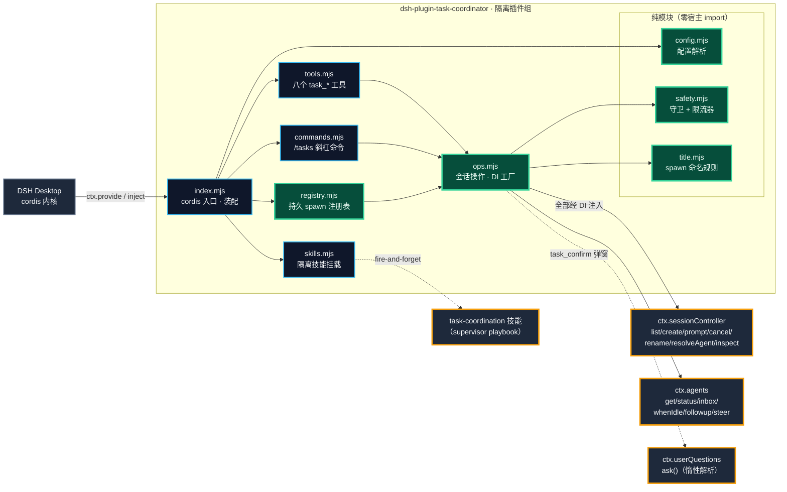

# 架构设计

> 本文面向要改插件源码、接宿主契约或维护本仓库的人。普通使用请看 [README](../README.zh-CN.md) 的快速开始。

## 为什么是插件而不是外挂

DSH 宿主已经把跨任务协调需要的原语全部暴露了——`ctx.sessionController`（Remote 门面）、`ctx.agents`（活体注册表）、`ctx.tools`（工具注册）、`api-session/added` 事件（侧栏可见性）。插件形态意味着：

- **零宿主改动**：cordis 插件组隔离挂载（`cordis.patch.yml` 的 `isolate: taskCoordinator`），一个故障不会拖垮宿主；
- **随装随卸**：`install.ps1` / `-Uninstall` 对称，卸载后不留工具、不留命令、不留技能；
- **命令面即合约**：八个 `task_*` 工具全部走 `defineTool` 注册、`/tasks` 斜杠命令走 `ctx.commands.register` 注册，模型面、快速通道与宿主面三者解耦。

## 模块分层

> 图注：`registry.mjs` 是唯一碰磁盘的逻辑模块（`node:fs`），职责边界是「近似原子写 + 损坏容错」，通过 DI 注入 `ops`，测试可用假路径隔离。

分层约束（与 [unity-pipe](https://github.com/Kayungko/unity-pipe) 的移植边界思路一致，这里用 DI 达成）：

- **纯模块**（`config.mjs` / `safety.mjs` / `title.mjs`）：零宿主 import，全部单测覆盖——55 个单元测试的主体；
- **`registry.mjs`**：持久 spawn 注册表（团队工作流的跨重启记忆）。读写永不抛错：损坏/缺失降级为空注册表，损坏文件保留为 `*.corrupt-<ts>`；写入近似原子（临时文件 + 重命名）；容量上限裁剪（`registryMaxEntries`）；0.5.0 起每条记录还带 `depth` 与 `parentSessionId`（递归治理的依据）；
- **`ops.mjs`**：工厂函数 `createOps(deps)`，宿主对象（sessionController / agents / createUserMessage / limiter / registry / uuid / askUser）**全部经依赖注入**，离开宿主进程可完整测试；
- **`tools.mjs`**：连 `defineTool` 都经注入——模型面注册与宿主包解耦；
- **`commands.mjs`**：`/tasks` 斜杠命令（0.4.0）——仿官方 `dsh-command-goal` 的 `inject=['commands']` + `ctx.commands.register` 模式；宿主无命令注册表时降级为 warning，工具面不受影响；
- **`index.mjs`**：唯一直接 import 宿主包（`dsh-tools` / `dsh-llm`）的装配层；`skills.mjs` 对 `dsh-skill-filesystem` 用**动态 import**；`ctx.get('userQuestions')` 在 `task_confirm` 调用时**惰性解析**（不硬注入，宿主缺该接缝时其余工具不受影响）。

## 机制设计（0.4.0–0.7.0 新增）

### 派发确认链（0.6.0）

`task_confirm` → 批准 → `task_spawn_batch` 携带 `confirmationId`，三段都是纯宿主侧：

1. **弹窗信道**：`ctx.get('userQuestions').ask()`——官方 `exit_plan_mode` 的同构路径（`intent.kind: 'plan-review'`），问题构造严格遵守收窄条件（单问题、≤2 选项、`detail` 非空、approve 标签与选项逐字一致），渲染出计划审批卡。**零客户端改动**；
2. **凭证生命周期**：批准时铸 `confirmationId`，存进程内 `Map`（`confirmationId → {callerSessionId, approvedAt}`）。**进程内、不落盘是有意的**——宿主重启后批准记录失效，总控重新确认一次，而不是拿过期批准派发；
3. **闸门位置**：`spawnBatch` 在校验之后、创建之前检查凭证（存在、属于调用方），成功后消耗；全部失败**不消耗**（同一方案不问第二遍）；
4. **错误映射**：`UserQuestionError.code` 逐一映射为本插件码表（`ASK_CANCELLED → confirm-cancelled` 等），agent 按码分支。

### 结果回报约定（0.7.0）

`reportBack`（默认开）在 `spawnTask` 里实现：开场词 = 用户 prompt + 追加段（`汇报约定：…task_send…<派发方 sessionId>…`）。两条边界：**注册表摘录永远记用户原始 prompt**（摘录是给人看的意图，不是派生文本）；追加段内置失败兜底（发送失败 → 写进最终回复），不依赖子会话的工具可用性。

### 递归治理（0.5.0）

深度不是配置出来的，是**从注册表推导**的：子深度 = 调用方已记录深度 + 1，从未被派生的根会话算 0。闸门在 `spawnTask` 入口（`spawnBatch` 的每一项都过 `spawnTask`，天然同限）。超限拒绝时明确指引用 subagent——subagent 是宿主原生面，不占本插件的深度预算。

## 降级策略

技能是伴侣，不是契约——`mountCoordinatorSkills` 是 fire-and-forget：

1. `dsh-skill-filesystem` 动态 import 失败 → 降级为一条 warning，八个工具照常注册；
2. `ctx.plugin(...)` 挂载失败 → 同样只打 warning；
3. 宿主无 `ctx.commands`（旧版本）→ `/tasks` 注册降级为 warning，工具面不受影响；
4. 宿主无 `userQuestions` 接缝或无 UI 连接 → `task_confirm` 返回 `no-question-channel`，其余七个工具不受影响。

工具注册先行、命令与技能挂载在后（`index.mjs` 的装配顺序即优先级）。

技能挂载本身走**隔离 provider**（同 `@openviking/dsh-memory-plugin` 先例）：`providerName: 'task-coordinator'`（永不与 DSH 的 `filesystem` 冲突）、`includeDefaultRoots: false`（只见本插件的 `skills/` 目录）。效果：编辑热加载（目录 watcher）、不遮蔽项目/用户技能、随插件卸载一起消失。

## 安全模型（守卫分层）

| 层 | 守卫 | 拒绝条件 |
|---|---|---|
| 调用方 | `checkCaller` | 无 agent 上下文；子代理来源且未开 `allowSubagentUse` |
| 目标 | `checkTarget` | 自寻址（自己发给自己）；目标不存在；目标是子代理会话（栅栏隔离） |
| 流量 | `SendLimiter` | 同一目标发送间隔 < `minSendIntervalMs`；目标排队深度 ≥ `maxQueuePerTask` |
| 派生治理 | 深度/确认闸门 | 子深度 > `maxSpawnDepth`（`spawn-depth-exceeded`）；达阈值的批量缺有效 `confirmationId`（`confirmation-required`） |

调用方身份**每次工具调用都从 `exec.agent` 重新推导**（`tools.mjs` 的 `callerFrom`），不接受调用方自报身份。

拒绝与失败一律携带**机器可读 `code`**（`DENIAL_CODES` / `OP_CODES`，完整码表见 [PROTOCOL.md §6](PROTOCOL.md)）——agent 按码分支，与 unity-pipe 的"退出码即语义"同一设计动机。

## 相关文档

- [PROTOCOL.md](PROTOCOL.md) — 主机契约与投递语义实测参考（sessionController 签名、queue/steer 边界、限流判据）
- [../skills/task-coordination/SKILL.md](../skills/task-coordination/SKILL.md) — supervisor 操作手册（随插件分发，模型实际读的就是它）
- [CHANGELOG](../CHANGELOG.md) — 版本更新日志
