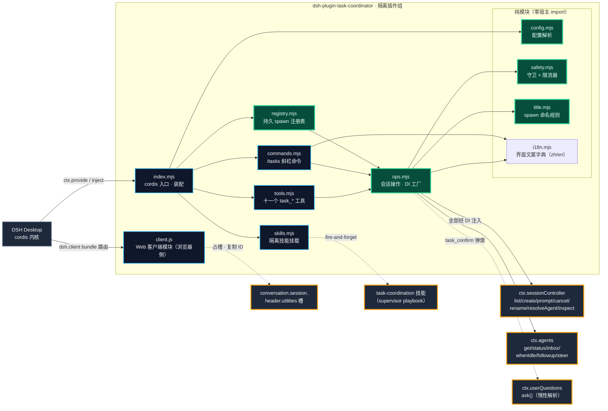

# 架构设计

> 本文面向要改插件源码、接宿主契约或维护本仓库的人。普通使用请看 [README](../README.zh-CN.md) 的快速开始。

## 为什么是插件而不是外挂

DSH 宿主已经把跨任务协调需要的原语全部暴露了——`ctx.sessionController`（Remote 门面）、`ctx.agents`（活体注册表）、`ctx.tools`（工具注册）、`api-session/added` 事件（侧栏可见性）。插件形态意味着：

- **零宿主改动**：cordis 插件组隔离挂载（`cordis.patch.yml` 的 `isolate: taskCoordinator`），一个故障不会拖垮宿主；
- **随装随卸**：`install.ps1` / `-Uninstall` 对称，卸载后不留工具、不留命令、不留技能；
- **命令面即合约**：十一个 `task_*` 工具全部走 `defineTool` 注册、`/tasks` 斜杠命令走 `ctx.commands.register` 注册，模型面、快速通道与宿主面三者解耦。

## 模块分层

> 图注：`registry.mjs` 是唯一碰磁盘的逻辑模块（`node:fs`），职责边界是「近似原子写 + 损坏容错」，通过 DI 注入 `ops`，测试可用假路径隔离。

分层约束（与 [unity-pipe](https://github.com/Kayungko/unity-pipe) 的移植边界思路一致，这里用 DI 达成）：

- **纯模块**（`config.mjs` / `safety.mjs` / `title.mjs`）：零宿主 import，全部单测覆盖——59 个单元测试的主体；
- **`registry.mjs`**：持久 spawn 注册表（团队工作流的跨重启记忆）。读写永不抛错：损坏/缺失降级为空注册表，损坏文件保留为 `*.corrupt-<ts>`；写入近似原子（临时文件 + 重命名）；容量上限裁剪（`registryMaxEntries`）；0.5.0 起每条记录还带 `depth` 与 `parentSessionId`（递归治理的依据）；
- **`i18n.mjs`**：界面文案字典（zh/en）与语言解析（0.15.0，纯模块零宿主 import）。`resolveUiLocale` 只认精确 `en`，其余一律落 zh（绝不猜测未内置的语言）；`uiStrings(locale)` 返回冻结字典——确认卡标签/标题/问题、多选卡文案、汇报约定后缀、`/tasks` 元数据。宿主侧每次调用实时读 settings `locale.preference`，切语言无需重启；
- **`ops.mjs`**：工厂函数 `createOps(deps)`，宿主对象（sessionController / agents / createUserMessage / limiter / registry / uuid / askUser）**全部经依赖注入**，离开宿主进程可完整测试；
- **`tools.mjs`**：连 `defineTool` 都经注入——模型面注册与宿主包解耦；
- **`commands.mjs`**：`/tasks` 斜杠命令（0.4.0）——仿官方 `dsh-command-goal` 的 `inject=['commands']` + `ctx.commands.register` 模式；宿主无命令注册表时降级为 warning，工具面不受影响；
- **`client.js`**：Web 客户端模块（0.8.0）——插件唯一运行在**浏览器侧**的产物。不经 cordis 入口装配，而是由宿主 `dsh-client-modules` 依 `dsh.client` 声明 + `exports["./client"]` 原样装载（`window.__ModuleLoader__` factory 格式），占 `conversation.session.header.utilities` 槽渲染「复制会话Id」按钮（面性胶囊：亮色黑底白字 / 暗色白底黑字，走 `--dsw-alias-label-primary(-foreground)` 主题 token，几何对齐「Session 日志」）；与宿主侧十一个模块完全解耦，缺槽位只影响该按钮；
- **`index.mjs`**：唯一直接 import 宿主包（`dsh-tools` / `dsh-llm`）的装配层；`skills.mjs` 对 `dsh-skill-filesystem` 用**动态 import**；`ctx.get('userQuestions')` 在 `task_confirm` 调用时**惰性解析**（不硬注入，宿主缺该接缝时其余工具不受影响）。

## 机制设计（0.4.0–0.15.0 新增）

### 派发确认链（0.6.0）

`task_confirm` → 批准 → `task_spawn_batch` 携带 `confirmationId`，三段都是纯宿主侧：

1. **弹窗信道**：`ctx.get('userQuestions').ask()`——官方 `exit_plan_mode` 的同构路径（`intent.kind: 'plan-review'`），问题构造严格遵守收窄条件（单问题、≤2 选项、`detail` 非空、approve 标签与选项逐字一致），渲染出计划审批卡。**零客户端改动**；
2. **凭证生命周期**：批准时铸 `confirmationId`，存进程内 `Map`（`confirmationId → {callerSessionId, approvedAt}`）。**进程内、不落盘是有意的**——宿主重启后批准记录失效，总控重新确认一次，而不是拿过期批准派发；
3. **闸门位置**：`spawnBatch` 在校验之后、创建之前检查凭证（存在、属于调用方），成功后消耗；全部失败**不消耗**（同一方案不问第二遍）；
4. **错误映射**：`UserQuestionError.code` 逐一映射为本插件码表（`ASK_CANCELLED → confirm-cancelled` 等），agent 按码分支。

多选变体（0.10.0）：`task_confirm_select` 用**同一接缝的通用提问渲染**（无 `plan-review` 意图 → 宿主中性样式、无琥珀 warn）：`multiSelect` 单问题 + 选项即任务清单 + 原生自定义输入行；凭证携带**选中子集**，`spawnBatch` 对子集凭证强制批量标题 ⊆ 选中集（`confirmation-mismatch`）。通用 UI 无 markdown 主体，完整方案由总控先写在聊天里。

任务级复用凭证（0.11.0）：`reusable: true` 使凭证记录携带 `reusable` 标记，`spawnBatch` 成功后的消耗逻辑对其跳过——同一 `confirmationId` 覆盖长程任务的多个里程碑批量（"首次分析后确认一次"）；跨会话借用仍被拒、子集强制仍逐批生效。

### 结果回报约定（0.7.0）

`reportBack`（默认开）在 `spawnTask` 里实现：开场词 = 用户 prompt + 追加段（`汇报约定：…task_send…<派发方 sessionId>…`）。两条边界：**注册表摘录永远记用户原始 prompt**（摘录是给人看的意图，不是派生文本）；追加段内置失败兜底（发送失败 → 写进最终回复），不依赖子会话的工具可用性。

### 递归治理（0.5.0）

深度不是配置出来的，是**从注册表推导**的：子深度 = 调用方已记录深度 + 1，从未被派生的根会话算 0。闸门在 `spawnTask` 入口（`spawnBatch` 的每一项都过 `spawnTask`，天然同限）。超限拒绝时明确指引用 subagent——subagent 是宿主原生面，不占本插件的深度预算。

### 工作区归属（0.8.1）

宿主 `create` 对 `workspaceId` 与 `cwd` 是**互斥**语义，且只有 `workspaceId` 触发 `workspace.attachSession`。`spawnTask` 因此先解析调用方的工作区成员归属（调用方自身 + `parentSessionId` 祖先链 ≤8 跳，与工作区 `sessionIds` 求交），命中传 `workspaceId`（宿主以工作区路径为 cwd 并挂入），显式 `cwd` 优先、无归属降级为旧语义——子任务与总控在同一工作区侧栏可见。

cwd→工作区升级与既有会话迁移（0.12.0）：将发送的 cwd 与工作区 path **精确匹配**（`normalizeWorkspacePath` 按平台分支 [0.12.1]：win32 分隔符归一+大小写折叠、darwin 仅折叠、POSIX 保留大小写；非 realpath，宿主实体校验才是权威）时改发 `workspaceId`，跨目录派发与未分组总控的子任务不再落入「未分组」；`task_workspace` 工具直连 `workspaceRegistry.get(id)` 活实体的 `attachSession`/`detachSession`（宿主 create 内部同一 API，自带会话头 cwd 与工作区 path 全等校验、幂等），迁移历史未分组会话且**不注入任何消息**。GUI 无此入口（拖拽 = `insertSessionBefore`，仅区内重排序）——插件面是唯一干净通道。

### 子会话模型指定（0.13.0）与路线发现（0.14.0）

`spawnTask` 接受可选 `provider`+`model`（+`reasoningEffort`，成对约束），走两级校验链：**目录预校验**（`llm.resolveCallConfig`，创建会话前拒绝无效路线——零孤儿；服务缺失优雅跳过）→ **创建后、开场前** `sessionController.selectModel` 安装（选择以 `model/selection` 会话事件持久化，重启存活；失败报孤儿 id、绝不用错误模型开场）。关键宿主事实（源码核验，`dsh-api-session-controller` 600-628 行）：`selectModel` 是会话级模型指定的**唯一公开入口**，且会经 `agentDefaultModel.saveSelection` 同步更新应用级默认模型（「最近选择即默认」，GUI 选择器同行为）；真正会话本地的 `selectForNextRequest` 是控制器内部方法、插件不可达——因此选择走公开 API 并在工具描述/手册如实披露该副作用，而非仿写内部行为绕过。

路线发现（0.14.0）：市场分发下**每个部署接入的 provider/model 都不同**，id 从不写死、不靠猜——`task_models` 调 Remote 门面的公开方法 `sessionController.modelCatalog()`（2722 行；内部 `buildModelCatalog` 聚合 `llm.listProviders/listModels/resolveModelInfo`，1933-1980 行，GUI 模型选择器同源），投影为精确可用 id（provider 分组/model/efforts/应用级默认/单点失败隔离）。`model-unavailable` 错误经 `describeModelRoutes` 附「该 provider 实际提供的模型」或「可路由 provider 列表」提示——失败容忍契约：目录依赖任何异常只退回原始错误，绝不遮蔽拒绝原因。老宿主无 `modelCatalog` 时降级 `catalog-unavailable`。

### 界面本地化（0.15.0）

用户可见文案分两线。**浏览器侧**：按钮接入宿主 `LocaleRuntime`（官方 session-log-export 同款通道）——`inject` 不硬声明 locale，防御性访问 `ctx.locale`，老宿主保住中文按钮而非整个模块拒载；`register(NS, {zh,en})` 注册词典 + `translate(NS, key)` 实时解析 + `getSnapshot/subscribe` 驱动 `useSyncExternalStore` 重渲染（语言切换与词典注册都 bump revision）；服务缺失/注册被拒/React 无 uSES 任一情况退回内置中文字典。**宿主侧**：确认卡标签/标题/问题、多选卡、汇报约定开场后缀、`/tasks` 元数据经 `readUiLocale`（读 settings 命名空间 `locale` 字段 `preference`；`settings.get(ns)` 直接返回解析值）每次调用实时解析 `i18n.mjs` 冻结字典——切换语言后下一张卡/下一次开场即生效（`/tasks` 描述挂载时捕获，随下次重挂载）。回退纪律：只认精确 `en`，缺失或不可识别一律 zh——「未设置=跟随浏览器语言」是浏览器侧委托语义，宿主侧不可见，绝不猜测。模型面不变（英文工具描述=模型契约、中文 SKILL 手册、`MMDD｜类型｜主题` 命名约定——文档化协议而非 UI 装饰）。

### 客户端模块装载要点（0.8.0–0.8.2）

两段实测教训沉淀为硬契约：① `dsh.client` 声明 + `exports["./client"]` 之外，**还必须导出 `exports["./package.json"]`**——扫描器经 `createRequire(baseUrl).resolve('<包名>/package.json')` 定位清单，缺该导出会 `ERR_PACKAGE_PATH_NOT_EXPORTED` 且被静默排除（0.8.2 根因）；② bundle 必须是 `window.__ModuleLoader__.load({id, factory})` 注册、原样下发，`apply(ctx)` 在客户端纤维执行、`inject: ["slots"]` 声明依赖。完整五步链见 [PROTOCOL.md §15](PROTOCOL.md)。

### 部署卫生（0.8.4）

`install.ps1` 复制技能目录必须拷**内容**（`skills\*` → 目标）而非目录本身：PowerShell `Copy-Item` 在目标目录已存在时会把源目录拷进去，0.4.0–0.8.3 由此产生嵌套 `skills/skills/`、正式路径 SKILL.md 从未更新（总控一直加载旧版操作手册）。脚本现拷内容并清理历史嵌套残留。

### 总控触发可靠性（0.9.0）

实测失效模式：用户在 goal 会话里含糊授权（「可以随时使用 /task 插件」）→ 名称无法解析 + 授权非要求 → 模型单干。三层加固：**工具描述**带总控触发语境（`task_spawn`/`task_spawn_batch` 描述点名「拆分/并行/协调任意措辞」并指向技能）、**技能描述**带口语别名表（/task 插件、派发子任务会话…）、**手册与 README** 带指令模板（含 /goal objective 写法）。佐证：点名工具的 steer 指令使该 goal 会话立即派发 3 个子任务会话（同工作区）。确认卡同时把 `plan` 收紧为 `# ` 一级标题开头，与官方 `exit_plan_mode` 的 plan-review 校验同式——渲染器本就是宿主官方同款，视觉一致性内禀，此改对齐内容规范。

## 降级策略

技能是伴侣，不是契约——`mountCoordinatorSkills` 是 fire-and-forget：

1. `dsh-skill-filesystem` 动态 import 失败 → 降级为一条 warning，十一个工具照常注册；
2. `ctx.plugin(...)` 挂载失败 → 同样只打 warning；
3. 宿主无 `ctx.commands`（旧版本）→ `/tasks` 注册降级为 warning，工具面不受影响；
4. 宿主无 `userQuestions` 接缝或无 UI 连接 → `task_confirm` 返回 `no-question-channel`，其余七个工具不受影响。

工具注册先行、命令与技能挂载在后（`index.mjs` 的装配顺序即优先级）。

技能挂载本身走**隔离 provider**（同 `@openviking/dsh-memory-plugin` 先例）：`providerName: 'task-coordinator'`（永不与 DSH 的 `filesystem` 冲突）、`includeDefaultRoots: false`（只见本插件的 `skills/` 目录）。效果：编辑热加载（目录 watcher）、不遮蔽项目/用户技能、随插件卸载一起消失。

## 安全模型（守卫分层）

| 层 | 守卫 | 拒绝条件 |
|---|---|---|
| 调用方 | `checkCaller` | 无 agent 上下文；子代理来源且未开 `allowSubagentUse` |
| 目标 | `checkTarget` | 自寻址（自己发给自己）；目标不存在；目标是子代理会话（栅栏隔离） |
| 流量 | `SendLimiter` | 同一目标发送间隔 < `minSendIntervalMs`；目标排队深度 ≥ `maxQueuePerTask` |
| 派生治理 | 深度/确认闸门 | 子深度 > `maxSpawnDepth`（`spawn-depth-exceeded`）；达阈值的批量缺有效 `confirmationId`（`confirmation-required`） |

调用方身份**每次工具调用都从 `exec.agent` 重新推导**（`tools.mjs` 的 `callerFrom`），不接受调用方自报身份。

拒绝与失败一律携带**机器可读 `code`**（`DENIAL_CODES` / `OP_CODES`，完整码表见 [PROTOCOL.md §6](PROTOCOL.md)）——agent 按码分支，与 unity-pipe 的"退出码即语义"同一设计动机。

## 相关文档

- [PROTOCOL.md](PROTOCOL.md) — 主机契约与投递语义实测参考（sessionController 签名、queue/steer 边界、限流判据）
- [../skills/task-coordination/SKILL.md](../skills/task-coordination/SKILL.md) — supervisor 操作手册（随插件分发，模型实际读的就是它）
- [CHANGELOG](../CHANGELOG.md) — 版本更新日志
